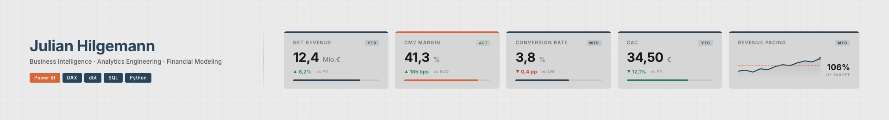

---

**Julian Hilgemann**

Business Intelligence · Analytics Engineering · Advanced Analytics

[LinkedIn](https://linkedin.com/in/julian-hilgemann/) · [Email](mailto:hilgemann.julian@gmail.com) · [Website](https://julianhilgemann.com/?utm_source=github&utm_medium=referral&utm_campaign=github-profile&utm_content=bio-link)

I work on the layer between data infrastructure and business decisions — semantic models, KPI logic, and the reporting interfaces where numbers actually get used. Day to day that means Power BI, DAX, dbt, and SQL, with Python for anything that needs modeling or automation.

My background is in economics and business (B.Sc. Business Administration, graduate work in quantitative economics and time series). Professionally I've spent the last 3 years in fintech, building revenue forecasting models, lead-scoring pipelines, funnel analytics, and investor-grade reporting across a portfolio covering €4bn+ in annual volume.

I'm also genuinely enthusiastic about generative AI and LLM-based workflows — I use agentic tooling daily for prototyping, analysis, and context engineering, and I think the intersection of GenAI, analytics engineering and BI is where a lot of the interesting work is heading.

---

### ⭐ Featured Project

<table>
<tr>
<td width="55%">

#### [Vantage Alpin — End-to-End BI Pipeline](https://github.com/julianhilgemann/BI-Pipeline)

Full analytics stack for a simulated DACH e-commerce business — from stochastic data generation to a production-grade Power BI reporting layer.

**Data Generation** — NHPP-driven demand simulation with seasonal, trend, and event components  
**Transformation** — dbt with Kimball star schema, marketing cost allocation, currency normalization  
**Semantic Model** — Layered DAX measure taxonomy, calculation groups, field parameters, RLS, TMDL version control  
**Dashboard** — Progressive-disclosure layout with budget variance, time intelligence, and dynamic KPI switching  

`Python` `dbt` `DuckDB` `Power BI` `DAX`

</td>
<td width="45%">

Star schema with synthetic dim_date (DACH holidays, ISO fiscal periods), no calculated columns

</td>
</tr>
</table>

---

### 🌐 Data Apps & Tools

**[Yield Curve Heatmap](https://julianhilgemann.github.io/yield_curve_heatmap_app/)**  
Interactive browser-based visualization of the German government yield curve. Fetches 25+ years of monthly Svensson zero-coupon yields directly from the Bundesbank's SDMX REST API and renders them as a smooth, pixel-interpolated heatmap — 2008, the negative-rate era, and the 2022 hiking cycle all visible at a glance. 26 color palettes, interactive tooltip, configurable date/maturity range, and high-resolution PNG export.  
`React` `D3` `Canvas API` `Bundesbank SDMX API`

**[VaultForge](https://julianhilgemann.github.io/obsidian_claude_vault_forge_app/)**  
Drop a PDF or EPUB, get an Obsidian vault. Parses documents client-side, sends sections to Claude via the Anthropic API, and returns atomic markdown notes with `[[wikilinks]]`, concept tags, and a live D3 knowledge graph — packaged as a ready-to-open `.zip`. Runs entirely in the browser: no backend, no build step, no data leaves your machine.  
`HTML` `D3` `pdf.js` `Claude API`

**[Life in Weeks](https://julianhilgemann.github.io/life_in_weeks_app/)**  
Renders your entire lifespan as a 90×52 grid of weeks. Enter a birthday, pick a palette, label life phases, and export a high-resolution poster (up to 4K / A3 print-ready). Inspired by Tim Urban's *Your Life in Weeks*. Client-side only, mobile-first, dark/light mode.  
`React` `Canvas API`

**[ShaderGradient Playground](https://julianhilgemann.github.io/shader_gradient_app/)**  
Browser-based real-time shader gradient simulator built on Three.js and custom GLSL. Tweak geometry, noise, camera, and lighting live — then export as a looping GIF, WebM, or MP4. Includes 12 built-in presets, a frosted glass overlay tool, and JSX code output for drop-in use with the ShaderGradient React library. Zero build step, single HTML file.  
`Three.js` `GLSL` `Canvas API` `MediaRecorder` `WebCodecs`

---

### 📊 Business Intelligence & Dashboards

**[B2B Energy Trading Dashboard](https://github.com/julianhilgemann/dashboard-gallery/tree/main/energy-trading-dashboard)**  
Decision interface for energy key account managers. Spot market correlations, geospatial demand, dark-mode layout designed in Figma.  
`Power BI` `DAX` `Figma`

### 🔧 Data Pipelines & APIs

**[Agentic Financial Twin](https://github.com/julianhilgemann/Portfolio)**  
End-to-end data pipeline from Excel data contracts to ML forecasting and BI dashboard. Agents that spin up a data stack from a static Excel file, including Prophet-based revenue forecasting.  
`Python` `LLM Agents` `Prophet`

**[Zinskompass API](https://github.com/julianhilgemann/zinsapi)**  
German Bundesbank interest rate forecast API.  
`Python` `FastAPI`

**[German Macroeconomic API](https://github.com/julianhilgemann/macrodata)** *(wip)*  
LLM-augmented dashboarding API for German macroeconomic data.  
`Python` `FastAPI`

### 🎨 Data Visualization

**[Bundesbank Yield Curve Heatmap](https://github.com/julianhilgemann/dataviz/tree/main)**  
Visual exploration of the German yield curve over time.  
`Python` `Matplotlib`

### 📈 Advanced Analytics

**[YouTube Sentiment Snapshot](https://github.com/julianhilgemann/yt_sentiment_scraper)**  
One-shot analyzer of YouTube comment sentiment, themes, and emoji mood. Fetches all comments from a video, scores VADER sentiment, extracts emotional archetypes and surface themes, and renders a single dark-mode dashboard (SVG/PDF/PNG) summarizing audience bias and engagement trends.  
`Python` `VADER` `Pandas` `Matplotlib` `Emoji` `YouTube API`

**[Pipeline Conversion Forecast](https://github.com/julianhilgemann/pipeline-forecast)**  
Decision-kernel convolution model for B2B sales forecasting. Estimates daily expected wins from existing pipeline and forecasted arrivals using historical win-probability distributions. Includes walk-forward backtest.  
`Python` `SARIMAX` `Scipy` `Matplotlib`

---

### What I work with

| | |
| :--- | :--- |
| **BI & Interface** | Power BI, DAX, Tabular Editor, Figma |
| **Engineering** | SQL (Postgres), dbt, DuckDB, Python, Git |
| **Modeling** | Time series forecasting, econometrics, scikit-learn, Prophet |
| **Languages** | German (native), English (C1), Russian (C1) |
